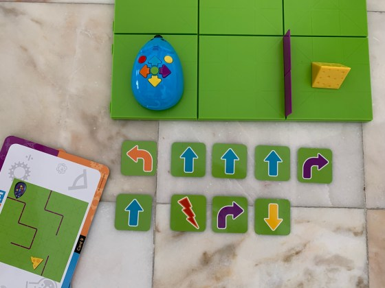

import { Aff } from 'astro-recommends/components';

When my son was 4-year-old, he received a Code And Go <Aff slug="robot-mouse">Robot Mouse</Aff> as a present and he absolutely loved it.

First of all, it is quite fun to play with, without requiring any reading or writing skills. The fact that the mouse moves according to what children program makes them feel empowered. They tell the mouse to move forward and the mouse goes forward!

It is also quite attractive to children because it moves, it is colorful, it makes noises and it has a simple and nice design. Finally, it is a robust toy. Our toddler is great at testing toys’ robustness, so we left <Aff slug="robot-mouse">Robot Mouse</Aff> with him for a while and it survived all the challenging tests.

As a parent, I was also very pleased with Code And Go <Aff slug="robot-mouse">Robot Mouse</Aff> and I strongly recommend it, if you want to introduce your under 8 years old child to programming.

The manufacturer’s recommended minimum age is 5, but it really depends from child to child. Here are the required skills from your child to take advantage of <Aff slug="robot-mouse">Robot Mouse</Aff>:

- Your child understands the concept of left, right, forward and backward;
- Your child can count up to 10;
- Draw 5 squares, put a toy on the first square and a cross on the last square. Ask your child how many squares the toy needs to step on to reach the cross. If your child struggles, he/she won’t be ready for Robot Mouse;
- Your child can focus for at least 2 minutes.

## How does Code And Go Robot Mouse work?

<Aff slug="robot-mouse">Robot Mouse</Aff> has quite a few cards with recommended exercises from basic to advanced. Each exercise shows how you should build the setup: the maze grids where Colby (the mouse’s name) will move, where Colby and the cheese go, and a few other details.

After building the maze and putting Colby and the cheese in the right place, your child will then need to program the mouse to reach the cheese with the following options available:

- Move forward;
- Move backward;
- Rotate 90 degrees to the left;
- Rotate 90 degrees to the right;
- Action: either the mouse makes noise or it moves forward and backward once;
- Go: the mouse executes what was programmed to do;
- Clear: the previous program is cleared.

Your child can start by drafting the program using the coding cards.

Each coding card has one of the options mentioned above and you have repeated coding cards so that you can program the same option multiple times, e.g. go forward 3 times.

Code And Go Robot Mouse

The next step is to press on Colby’s buttons following the coding cards. Remember that you need to press the clear button before you start programming and press the go button once you finish.

With Colby in the initial square, can it reach the cheese when you press the go button?

## What will your child learn?

Your child will learn quite a few concepts with <Aff slug="robot-mouse">Robot Mouse</Aff>:

- The concept of programming – program Colby to move from one place to another using the coding cards and then using the buttons;
- The concept of randomness, with the action button;
- Debugging – while Colby is moving, follow the coding cards with your finger. If Colby isn’t going where it should, there is either a mistake on that coding card, or you pressed the wrong buttons.

<Aff slug="robot-mouse">Robot Mouse</Aff> also develops concentration, resilience, attention to detail, critical thinking, coding skills, problem-solving, visual tracking, among others.

## Conclusion

<Aff slug="robot-mouse">Robot Mouse</Aff> is a very fun and engaging way to introduce programming to children. Lots of adults who visited us and don’t know how to program also got very involved with Robot Mouse.

It uses very simple concepts and clear steps with a colorful and nice looking [STEM](https://en.wikipedia.org/wiki/Science,_technology,_engineering,_and_mathematics) toy for boys and girls. Without reading or writing skills, anyone can learn the concept of programming.
